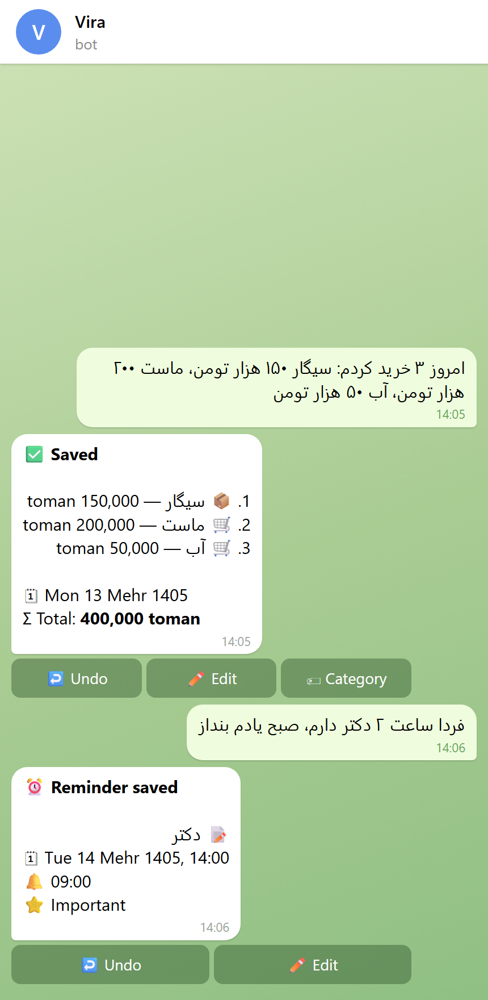
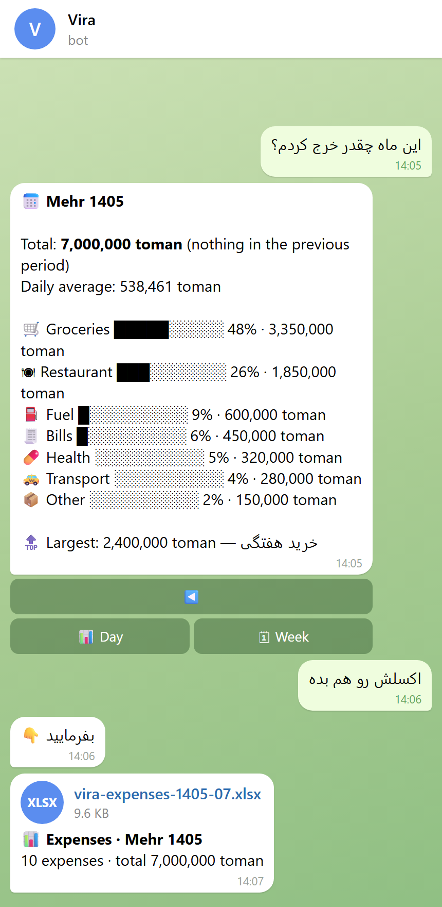
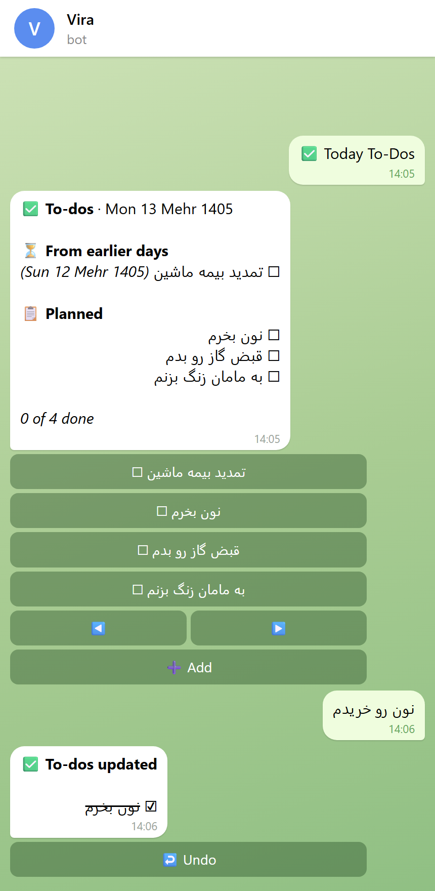
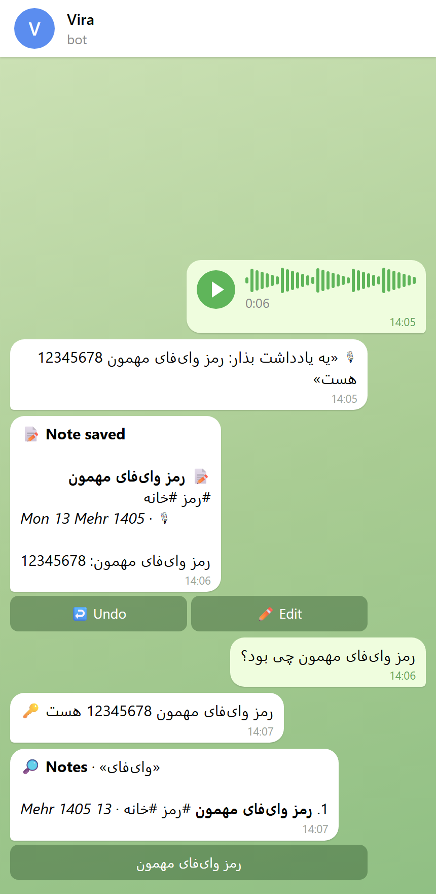

<div align="center">

# 🤖 Vira Assistant

**A personal AI assistant on Telegram that understands what you say and does it:**
**reminders, expenses, reports, notes and voice. Persian and English. Runs with Docker.**

[English](#english) · [فارسی](#فارسی)


[](https://github.com/Rushqp/vira-assistant/actions/workflows/ci.yml)

</div>

---

<a id="english"></a>

## 🇬🇧 English

### What is Vira?

Vira is a **single-user** assistant you run on your own server (even a weak one) and talk to through
Telegram. Write the way you talk, in **Persian or English**, typos and all, and Vira understands and
acts:

- *«امروز ۳ خرید کردم: سیگار ۱۵۰ هزار، ماست ۲۰۰ هزار، آب ۵۰ هزار»* → three expenses saved
- *«فردا ساعت ۲ دکتر دارم، صبح یادم بنداز»* → reminder at 14:00, notification at 09:00
- *«تایم دکتر رو کنسل کن»* → that reminder is cancelled
- *«نه، ماست ۲۵۰ هزار بود»* → the expense is corrected
- *«این ماه چقدر خرج کردم؟»* → a monthly report
- *«اکسل خرج‌های خوراکی مهر رو بده»* → an Excel file with totals and charts
- *«فردا باید نون بخرم و قبض برق رو بدم»* → two to-dos for tomorrow; *«نون رو خریدم»* → ticked
- *«یادداشت کن رمز وای‌فای مهمون 12345678 هست»* → a note with a title and tags
- 🎙 a voice message → Vira shows what it heard and does it, like a typed message
- and ordinary questions, answered in your language

Every action shows what was done, with **↩️ Undo** and **✏️ Edit** buttons. Vira only asks when
something is really unclear, for example whether «۳ تومن» means 3 thousand or 3 million.

Under the hood an **AI agent** reads each message and calls typed tools (add expenses, create /
cancel reminders, reports, …). The app checks every tool call with deterministic Persian/English
parsers (Jalali dates, «هزار / میلیون» amounts) before acting. Reminders and the morning briefing
never depend on the AI. Design: [docs/AGENT_DESIGN.md](docs/AGENT_DESIGN.md).

### Screenshots

| Just talk | Reports and Excel |
|:---:|:---:|
|  |  |
| **To-dos** | **Voice notes** |
|  |  |

<sub>Real bot messages with sample data, drawn as a Telegram chat by
[`scripts/screenshots.py`](scripts/screenshots.py).</sub>

### Status

| Version | Scope | State |
|---|---|---|
| **v0.1.0** | Skeleton, Docker, menu, owner-only access, SQLite + Alembic, calendar setting, CI | ✅ Done |
| **v0.2.0** | Ollama + hardware profiles, streaming chat with short memory, calculator, today's date | ✅ Done |
| **v0.3.0** | Reminders (fa/en date parser, both calendars, repeats, snooze), morning briefing, previous chats | ✅ Done |
| **v0.4.0** | **AI agent** (understands any phrasing, follow-ups, undo / edit), free AI models from 5 providers with failover, model switching in the bot and notices, expenses, 13 categories with learning, reports | ✅ Done |
| **v0.5.0** | **Excel files from the chat** (expenses, reminders, any table), nightly report, briefing and report times in Settings | ✅ Done |
| **v0.6.0** | **Voice messages and audio files** → text (free Groq Whisper / Gemini, local faster-whisper as backup), handled like typed text | ✅ Done |
| **v0.7.0** | **To-dos** (daily list, unfinished ones carry over), **notes** (tags, search, voice notes with a summary, pin), **backup** (weekly + restore) — every menu button works | ✅ Done |
| **v1.0.0** | **One-command install** (also for servers in Iran: proxies and mirrors), `/status`, error reports in Telegram, health check and self-restart, lower memory use, 90%+ test coverage, install guide | ✅ Done |

The full plan is in [docs/ROADMAP.md](docs/ROADMAP.md).

### Quick start

You need a Linux server, a bot token from [@BotFather](https://t.me/BotFather), your numeric
Telegram ID from [@userinfobot](https://t.me/userinfobot) and, recommended, a free AI key:
[Google AI Studio](https://aistudio.google.com/apikey) (Gemini) and/or
[Groq](https://console.groq.com/keys) (more in [AI models](#ai-models); several keys = automatic
failover). Then, on the server:

```bash
curl -fsSL https://raw.githubusercontent.com/Rushqp/vira-assistant/main/install.sh | bash
```

The installer installs Docker if needed, asks a few questions (it suggests a profile from your
RAM), writes `.env` and starts Vira. Open your bot in Telegram and send `/start`.

📦 **Step-by-step guide:** choosing a profile, installing by hand, **servers in Iran** (proxies and
mirrors), daily care and troubleshooting: **[docs/INSTALL.md](docs/INSTALL.md)**.

Already have Docker? By hand:

```bash
git clone https://github.com/Rushqp/vira-assistant.git && cd vira-assistant
cp .env.example .env           # BOT_TOKEN, OWNER_ID, PROFILE, an API key (remote: COMPOSE_PROFILES=)
docker compose up -d --build   # with a local profile, the first start downloads the model
```

### Updating

Run the installer again, or on the server, in the project folder:

```bash
git pull                       # the latest released version (branch main)
docker compose up -d --build   # rebuilds the image; the bot restarts with your data
docker compose logs -f bot     # check that it started (Ctrl+C leaves the log)
```

- Your data stays in `./data` (database, downloaded voice models) and `./models` (Ollama): nothing
  is lost, and database changes are applied automatically at startup.
- New settings always have defaults; compare your `.env` with `.env.example` to use new features.
- Before a big update you can send `/backup` to the bot to keep a copy of your data.
- To try a version before its release: `git checkout dev && git pull`, then the same
  `docker compose up -d --build`; `git checkout main && git pull` goes back to the released one.
- Old images take disk space: `docker image prune -f` removes the unused ones.

### How Vira thinks

| Step | What happens |
|---|---|
| 1 | Calculator and "what's the date?" are answered instantly, without AI |
| 2 | The **agent** reads the message with recent context (and the dates of the coming days in both calendars) and decides which tools to call |
| 3 | Each tool call is validated: amounts and dates are re-checked by deterministic parsers; mistakes go back to the AI to fix |
| 4 | You get a card for every real result, with ↩️ Undo / ✏️ Edit |
| — | AI models are tried in order (`LLM_PROVIDERS`, or the model you chose in 🤖 AI model): a model that is down or out of free quota is paused, the next one answers and you get a notice |
| — | If no AI is reachable, the v0.3 rule-based understanding still handles reminders, expenses and reports |

Privacy: with an API provider, your message text is sent to that provider (your database stays on
your server). For fully local operation use `standard` / `full` without API keys.

### AI models

All of these have a free tier. Add any of the keys to `.env` (more keys = more backups):

| Provider | Key (`.env`) | Free models in the menu |
|---|---|---|
| [Google AI Studio](https://aistudio.google.com/apikey) | `GEMINI_API_KEY` | Gemini Flash, Gemini Flash-Lite |
| [Groq](https://console.groq.com/keys) | `GROQ_API_KEY` | GPT-OSS 120B, GPT-OSS 20B, Llama 3.3 70B, Qwen 3.8 27B |
| [Mistral](https://console.mistral.ai/api-keys) (free *Experiment* plan) | `MISTRAL_API_KEY` | Mistral Small, Medium, Large |
| [GitHub Models](https://github.com/settings/personal-access-tokens) (token with *Models* access) | `GITHUB_TOKEN` | GPT-4.1 mini, GPT-4.1, GPT-4o mini, GPT-5 mini |
| [OpenRouter](https://openrouter.ai/keys) | `OPENROUTER_API_KEY` | OpenRouter Free (picks a free model that supports tools) |
| Ollama (local) | — | the profile model and every model you pulled |

- **Switch models in the bot:** ⚙️ Settings → 🤖 AI model (or `/model`). The screen shows the order,
  the model answering now and the paused ones (with the time they are tried again). Pick a model to
  use it first, with the others as backups, or ✨ Auto for the configured order. The choice
  survives restarts.
- **Notices:** when a model stops answering (free quota used up, key rejected, not reachable), the
  next one answers and Vira tells you, e.g. «🔁 **Gemini Flash · Gemini** isn't available (free
  quota used up), so **GPT-OSS 120B · Groq** answered. I'll try it again at 14:32.» You also hear
  when it is back, and when no model is left and Vira works in basic mode.
- Free limits change over time; a model that keeps failing is simply skipped. Any other model of
  these providers works too: set `GROQ_MODEL`, `OPENROUTER_MODEL`, … in `.env`.

### Using it

- **Just talk.** Several requests in one message are fine. Follow-ups work: "cancel it", «پاکش کن»,
  «ساعتش رو بکن ۵».
- **Reminders:** events and notifications are understood separately («… صبح یادم بنداز»).
  Without a notification time, Vira notifies at the start and offers buttons for 15 min / 1 hour
  before, the night before or the morning of the day. Repeats: every day / week / month.
  Notifications have **Done**, **+10 min** and **+1 hour**. 📋 **Reminders** lists them.
- **Expenses:** several items at once, quantities («۱۰ لیتر»), past days («دیروز»). Categories are
  chosen by the AI; corrections are remembered (🏷 on a saved expense, or just say it).
  ⚙️ Settings → 🏷 Categories adds or removes categories.
- **Reports:** 📊 **Today Report**, 📅 **Month Report** (Jalali or Gregorian month), or just ask:
  total, comparison with the previous period, daily average, per-category bars, largest expense.
- **Excel files:** just ask in the chat, no button needed. *«اکسل هزینه‌های این ماه رو بده»*,
  *«خرج‌های بنزین امسال رو اکسل کن با جمع هر ماه»*, *«یادآورهای هفته بعد رو اکسل کن»*, or any
  table: *«یه برنامه ورزشی هفتگی به صورت اکسل بده»*. Expense files have a sheet of every
  expense plus totals per category / day / week / month with charts, in the selected
  calendar. Without details you get this month.
- ✅ **To-dos:** say what you need to do (*«فردا باید نون بخرم»*), or ✅ Today To-Dos → ➕ Add.
  Without a time or «یادم بنداز» it is a to-do; with them, a reminder. Tick with a tap or say
  *«نون رو خریدم»*. Unfinished to-dos stay on today's list with their original day; ◀️ ▶️ show
  other days.
- 📝 **Notes:** *«یادداشت کن …»*, or a long voice message, which is kept word for word with a
  title and a short summary. Tags are added automatically; find notes by asking (*«یادداشت‌های
  ماشین رو بیار»*) or with 📝 Notes, where you can 📌 pin, ✏️ edit and 🗑 delete them.
- 💾 **Backup:** `/backup` or ⚙️ Settings → 💾 Backup sends all your data as one file, and a copy
  comes every Friday night. To restore (e.g. on a new server), send the file back to the bot:
  it asks for confirmation and sends the current data first.
- **Morning briefing:** every day at 08:00, today's reminders, important ones (⭐) first, and
  today's to-dos.
- **Nightly report:** every day at 22:00, today's expenses (with a nudge when nothing was
  recorded), this month so far and tomorrow's reminders.
- ⚙️ **Settings → ☀️ Morning briefing / 🌙 Nightly report:** on / off and the time (or just say
  *«گزارش شبانه رو ساعت ۱۱ بفرست»*).
- 🎙 **Voice messages and audio files:** just talk. Vira shows what it heard («🎙 …») and then
  handles it exactly like a typed message, also as the answer to one of its questions.
  Transcription uses free Groq Whisper large-v3 first (`GROQ_API_KEY`, about 8 hours of
  audio a day), then Gemini, and faster-whisper on your server as the backup (`standard`:
  `small`, `full`: `large-v3-turbo`; downloaded the first time it is needed). Up to 10 minutes
  per recording; round videos are not transcribed.
- 💬 **New Chat** starts a fresh conversation; 🗂 **Chats** continues an older one.
- 🤖 **AI model** (⚙️ Settings or `/model`): see which models are ready and choose the one that
  answers first.

### Keeping an eye on it

- **`/status`** shows the version, how long Vira has been running, the AI model answering now and
  the paused ones, the voice engine, memory use, how much data you have, the database size, the
  last backup and the errors since the start.
- **Error reports:** when a message, a button or a scheduled job fails, Vira sends you a short ⚠️
  report in Telegram (at most one every 10 minutes; details in the log), and a button that fails
  shows an alert instead of doing nothing.
- **Health check:** the bot writes a heartbeat every 30 seconds. `docker compose ps` shows it as
  `healthy`, and a bot that hangs for 5 minutes restarts by itself.

### Configuration (`.env`)

| Variable | Default | Description |
|---|---|---|
| `BOT_TOKEN` | — | Bot token from @BotFather (**required**) |
| `OWNER_ID` | — | Your Telegram user ID. All other users are ignored (**required**) |
| `TELEGRAM_PROXY` | empty | Proxy for Telegram, only where it is blocked: `socks5://host:port`, `http://host:port` |
| `API_PROXY` | empty | Proxy for the AI and speech APIs and for local model downloads (not for the local Ollama), e.g. on a server in Iran |
| `TZ` | `Asia/Tehran` | Timezone used for display and scheduling |
| `DEFAULT_CALENDAR` | `jalali` | `jalali` or `gregorian` (can be changed in Settings) |
| `CURRENCY` | `toman` | `toman` or `rial` |
| `PROFILE` | `standard` | Hardware profile: `lite`, `standard`, `full`, `remote` |
| `COMPOSE_PROFILES` | `ollama` | Starts the local Ollama containers; empty for `remote` |
| `LLM_PROVIDERS` | `gemini,groq,mistral,github,openrouter,local` | Order in which AI providers are tried; ones without a key are skipped (🤖 AI model can put any model first) |
| `GEMINI_API_KEY` / `GEMINI_MODEL` | empty / `gemini-flash-latest` | Free Google Gemini API |
| `GROQ_API_KEY` / `GROQ_MODEL` | empty / `openai/gpt-oss-120b` | Free Groq API |
| `MISTRAL_API_KEY` / `MISTRAL_MODEL` | empty / `mistral-small-latest` | Free Mistral API (Experiment plan) |
| `GITHUB_TOKEN` / `GITHUB_MODEL` | empty / `openai/gpt-4.1-mini` | Free GitHub Models API |
| `OPENROUTER_API_KEY` / `OPENROUTER_MODEL` | empty / `openrouter/free` | Free OpenRouter models |
| `LLM_BASE_URL` | `http://ollama:11434/v1` | The `local` provider: Ollama, or any OpenAI-compatible API (e.g. LM Studio) |
| `LLM_MODEL` | profile default | Model of the `local` provider |
| `LLM_API_KEY` | `ollama` | API key of the `local` provider |
| `LOCAL_TOOLS` | `auto` | Agent tools with the local model: `auto` (by model family), `on`, `off` |
| `LLM_TIMEOUT` | `180` | Seconds to wait for the local model |
| `CHAT_MEMORY` | `10` | How many previous messages the assistant sees (0–50) |
| `CHAT_KEEP` | `20` | How many previous chats are kept in 🗂 Chats |
| `OLLAMA_KEEP_ALIVE` | `30m` | How long the local model stays in RAM after use (`-1` = forever) |
| `OLLAMA_CONTEXT_LENGTH` | `8192` | Context of the local model in tokens (the agent needs about 5k) |
| `STT_ENABLED` | `true` | Voice messages and audio files are transcribed |
| `STT_PROVIDERS` | `groq,gemini,local` | Order of the speech-to-text engines; ones without a key or model are skipped |
| `GROQ_STT_MODEL` | `whisper-large-v3` | Groq Whisper model (or `whisper-large-v3-turbo`) |
| `STT_MODEL` | profile default | Local faster-whisper model (`tiny` … `large-v3`, `large-v3-turbo`) |
| `MORNING_TIME` … `NIGHT_TIME` | `09:00` `12:00` `16:00` `19:00` `22:00` | Clock times for morning, noon, afternoon, evening, night |
| `MORNING_BRIEFING_TIME` | `08:00` | Default time of the morning briefing (change it in ⚙️ Settings) |
| `DAILY_REPORT_TIME` | `22:00` | Default time of the nightly report (change it in ⚙️ Settings) |
| `LOG_LEVEL` | `INFO` | `DEBUG`, `INFO`, `WARNING` … |
| `PIP_INDEX_URL` | empty | PyPI mirror for building the image, only where pypi.org is blocked |

**Hardware profiles** (the free APIs come first in every profile when a key is set)

| Profile | Server RAM | Local model (RAM while loaded) | Local Whisper, voice backup (RAM while transcribing) | Without an API key |
|---|---|---|---|---|
| `remote` | 1 GB+ | none | none | needs an API key or `LLM_MODEL` |
| `lite` | 2 GB | `gemma3:1b`, chat only (≈ 1 GB) | none | rule-based understanding + local chat, no voice |
| `standard` | 4 GB | `qwen3:4b`, agent (≈ 3.3 GB) | `small` (up to ≈ 1.5 GB) | local agent, slower on CPU |
| `full` | 8 GB+ | `qwen3:8b`, agent (≈ 6 GB) | `large-v3-turbo` (≈ 2.5 GB) | local agent |

The bot itself uses **about 210 MB of RAM** (measured idle in Docker); the model sizes are
approximate. Local models take RAM only while they are used: Ollama unloads its model after
`OLLAMA_KEEP_ALIVE` (30 min) and Whisper leaves memory after 10 idle minutes, so with API keys they
are rarely loaded at all. Disk space per profile: [docs/INSTALL.md](docs/INSTALL.md).

Measure accuracy and speed of your models on your own server:
`docker compose exec bot python scripts/eval_agent.py` (`--all` = every model of the menu).

### Source code map

```
app/
├── main.py            # Entry point: logging → migrations → scheduler → bot polling
├── health.py          # Heartbeat + watchdog: Docker health check, restart when the bot hangs
├── config.py          # All settings from .env (pydantic-settings) + hardware profiles
├── texts.py           # Every user-facing string (edit wording here only)
├── agent/             # The brain: an AI agent with typed tools
│   ├── core.py        #   the loop: model → tool calls → results → short answer
│   ├── tools/         #   expenses, reminders, to-dos, notes, files (Excel), general
│   │                  #   (reports, dates, settings); argument validation
│   ├── actions.py     #   undo log for everything the agent changed
│   ├── context.py     #   per-message context: now + dates table (Gregorian = Jalali)
│   └── prompt.py      #   the system prompt
├── llm/               # client.py = one OpenAI-compatible endpoint, models.py = free models,
│                      #   providers.py = failover chain (Gemini → Groq → Mistral → GitHub →
│                      #   OpenRouter → local), chosen model; failover.py = cooldowns and
│                      #   switch notices (shared with stt/); prompts/
├── stt/               # Voice → text: engines.py (Groq Whisper, Gemini, local
│                      #   faster-whisper), chain.py (order, failover)
├── bot/               # Telegram layer, no business logic
│   ├── handlers/      #   assistant (free text → agent), status (/status), chats, settings,
│   │                  #   categories, ai_models (🤖 AI model), backup, todos, notes, reminders,
│   │                  #   expenses, reports (buttons + rule-based fallback), fallback
│   ├── agent_ui.py    #   result cards with ↩️ Undo / ✏️ Edit, model switch notices
│   ├── errors.py      #   error reports to the owner (handlers, buttons, scheduled jobs)
│   ├── keyboards/     #   reply.py = main menu, inline.py = buttons under messages
│   ├── middlewares/   #   owner_only, logging, db (session + services), voice (voice → text
│   │                  #   before routing), menu_reset, notices
│   ├── views.py       #   reminder cards, notifications, briefing, expense cards, reports
│   ├── streaming.py   #   shows a streamed answer by editing the Telegram message
│   └── states.py      #   FSM states
├── core/              # Deterministic language tools (no AI)
│   ├── normalizer.py  #   fa/en digits, number words, Arabic letters, ZWNJ
│   ├── textmatch.py   #   fuzzy references («تایم دکتر» → the doctor reminder)
│   └── parsers/       #   dates & times, reminder sentences, amounts, expense sentences
├── services/          # Business logic, independent of Telegram: reminders, expenses,
│                      #   reports, export (Excel files), todos, notes, backup, chat history,
│                      #   settings, calculator
├── scheduler/         # due reminders, morning briefing, nightly report, weekly backup,
│                      #   releasing an unused local Whisper
├── db/                # models.py = tables, session.py = engine + migrations, migrate.py =
│                      #   migrations in a child process (keeps Alembic out of the bot's RAM)
└── utils/             # Jalali / Gregorian formatting, Markdown → HTML, money
scripts/eval_agent.py  # accuracy / latency of each configured model on real Persian cases
scripts/screenshots.py # the README screenshots: real bot messages drawn as a Telegram chat
install.sh             # one-command installer: Docker, the .env questions, start / update
migrations/            # Alembic migrations (one file per schema change)
tests/                 # pytest suite (no network or real model needed)
docker/                # Dockerfile, entrypoint, ollama-init.sh (pulls the profile model)
docs/                  # install guide, roadmap, agent design, screenshots
```

How a message flows: **Telegram → middlewares → `handlers/assistant.py` → `agent/core.py` ↔
`llm/providers.py` → `agent/tools/*` → `services/*` → database**, and the results come back as
cards from `bot/agent_ui.py`.

### Development

```bash
python -m venv .venv
source .venv/bin/activate          # Windows: .venv\Scripts\activate
pip install -e ".[dev]"
cp .env.example .env               # set BOT_TOKEN, OWNER_ID (and an API key)
python -m app.main                 # run the bot locally (DB in ./data)

pytest                             # tests
pytest --cov                       # tests + coverage (CI fails below 90%)
ruff check . && ruff format .      # lint + format
python scripts/eval_agent.py       # how well the configured models understand real messages
python scripts/screenshots.py      # redraw docs/screenshots (needs Edge or Chrome)
alembic revision -m "describe"     # new migration
```

Branches: `main` (stable) and `dev` (development). Commits follow
[Conventional Commits](https://www.conventionalcommits.org/). Each version is tagged and published as
a GitHub Release. See [CHANGELOG.md](CHANGELOG.md).

### License

[MIT](LICENSE)

---

<a id="فارسی"></a>

<div dir="rtl">

## 🇮🇷 فارسی

### ویرا چیست؟

ویرا یک دستیار شخصی **تک‌کاربره** است که روی سرور خودتان (حتی یک سرور ضعیف) اجرا می‌شود و از طریق
تلگرام با آن حرف می‌زنید. همان‌طور که حرف می‌زنید بنویسید، **فارسی یا انگلیسی**، حتی با غلط تایپی؛ ویرا
منظورتان را می‌فهمد و انجام می‌دهد:

- «امروز ۳ خرید کردم: سیگار ۱۵۰ هزار، ماست ۲۰۰ هزار، آب ۵۰ هزار» ← سه هزینه ثبت می‌شود
- «فردا ساعت ۲ دکتر دارم، صبح یادم بنداز» ← یادآور ساعت ۱۴ و اعلان ساعت ۹ صبح
- «تایم دکتر رو کنسل کن» ← همان یادآور کنسل می‌شود
- «نه، ماست ۲۵۰ هزار بود» ← هزینه اصلاح می‌شود
- «این ماه چقدر خرج کردم؟» ← گزارش ماه
- «اکسل خرج‌های خوراکی مهر رو بده» ← فایل اکسل با جمع‌ها و نمودار
- «فردا باید نون بخرم و قبض برق رو بدم» ← دو کار برای فردا؛ «نون رو خریدم» ← تیک می‌خورد
- «یادداشت کن رمز وای‌فای مهمون 12345678 هست» ← یادداشت با عنوان و برچسب
- 🎙 پیام صوتی ← ویرا متنی را که شنیده نشان می‌دهد و مثل پیام تایپی انجامش می‌دهد
- و سوال‌های معمولی که به زبان خودتان جواب داده می‌شوند

نتیجه هر کار با دکمه‌های **↩️ برگشت** و **✏️ ویرایش** نشان داده می‌شود. ویرا فقط وقتی چیزی واقعاً مبهم
باشد سوال می‌پرسد، مثلاً این‌که «۳ تومن» یعنی ۳ هزار یا ۳ میلیون.

در پشت صحنه یک **Agent هوش مصنوعی** هر پیام را می‌خواند و ابزارهای مشخصی را صدا می‌زند (ثبت هزینه،
ساخت یا کنسل یادآور، گزارش و …). برنامه هر کدام را قبل از اجرا با پارسرهای دقیق فارسی و انگلیسی
(تاریخ شمسی، مبلغ‌های «هزار / میلیون») بررسی می‌کند. یادآورها و خلاصه صبحگاهی هیچ وقت به هوش مصنوعی
وابسته نیستند. طراحی: [docs/AGENT_DESIGN.md](docs/AGENT_DESIGN.md).

### تصویرها

| فقط حرف بزنید | گزارش و اکسل |
|:---:|:---:|
|  |  |
| **کارهای روزانه** | **یادداشت صوتی** |
|  |  |

<sub>پیام‌های واقعی ربات با اطلاعات نمونه که با [`scripts/screenshots.py`](scripts/screenshots.py) به شکل
چت تلگرام کشیده شده‌اند.</sub>

### وضعیت پروژه

| نسخه | محتوا | وضعیت |
|---|---|---|
| **v0.1.0** | اسکلت پروژه، داکر، منو، دسترسی فقط برای مالک، SQLite و Alembic، تنظیم تقویم، CI | ✅ انجام شد |
| **v0.2.0** | Ollama و پروفایل‌های سخت‌افزاری، چت استریمی با حافظه کوتاه، ماشین‌حساب، تاریخ امروز | ✅ انجام شد |
| **v0.3.0** | یادآورها (پارسر تاریخ فارسی/انگلیسی، هر دو تقویم، تکرار، تعویق)، خلاصه صبحگاهی، چت‌های قبلی | ✅ انجام شد |
| **v0.4.0** | **Agent هوش مصنوعی** (فهم هر جمله، پیگیری حرف‌های قبلی، برگشت / ویرایش)، مدل‌های رایگان هوش مصنوعی از ۵ سرویس با جایگزینی خودکار، عوض کردن مدل داخل ربات و اعلان، هزینه‌ها، ۱۳ دسته با یادگیری، گزارش‌ها | ✅ انجام شد |
| **v0.5.0** | **فایل اکسل از داخل چت** (هزینه‌ها، یادآورها، هر جدولی)، گزارش شبانه، تنظیم ساعت خلاصه صبحگاهی و گزارش شبانه | ✅ انجام شد |
| **v0.6.0** | **پیام صوتی و فایل صوتی** ← متن (Groq Whisper و Gemini رایگان، faster-whisper لوکال به‌عنوان پشتیبان)، دقیقاً مثل پیام تایپی | ✅ انجام شد |
| **v0.7.0** | **کارهای روزانه** (لیست هر روز، کارهای انجام‌نشده منتقل می‌شوند)، **یادداشت‌ها** (برچسب، جستجو، یادداشت صوتی با خلاصه، سنجاق)، **پشتیبان‌گیری** (هفتگی و بازگردانی)؛ همه دکمه‌های منو کار می‌کنند | ✅ انجام شد |
| **v1.0.0** | **نصب با یک دستور** (برای سرورهای داخل ایران هم: پراکسی و میرور)، `/status`، گزارش خطا در تلگرام، بررسی سلامت و ری‌استارت خودکار، مصرف رم کمتر، پوشش تست بالای ۹۰٪، راهنمای نصب | ✅ انجام شد |

نقشه کامل پروژه در [docs/ROADMAP.md](docs/ROADMAP.md) است.

### راه‌اندازی سریع

یک سرور لینوکسی، توکن ربات از [@BotFather](https://t.me/BotFather)، شناسه عددی تلگرام از
[@userinfobot](https://t.me/userinfobot) و (پیشنهادی) یک کلید رایگان هوش مصنوعی لازم دارید:
[Google AI Studio](https://aistudio.google.com/apikey) (Gemini) و/یا [Groq](https://console.groq.com/keys)
(گزینه‌های دیگر در بخش «مدل‌های هوش مصنوعی»؛ چند کلید یعنی جایگزینی خودکار). بعد روی سرور:

</div>

```bash
curl -fsSL https://raw.githubusercontent.com/Rushqp/vira-assistant/main/install.sh | bash
```

<div dir="rtl">

نصب‌کننده اگر لازم باشد داکر را نصب می‌کند، چند سوال می‌پرسد (بر اساس رم سرور یک پروفایل پیشنهاد می‌دهد)،
فایل `.env` را می‌نویسد و ویرا را اجرا می‌کند. ربات را در تلگرام باز کنید و `/start` را بفرستید.

📦 **راهنمای قدم به قدم:** انتخاب پروفایل، نصب دستی، **سرور داخل ایران** (پراکسی و میرور)، نگهداری و رفع
مشکل: **[docs/INSTALL.md](docs/INSTALL.md#فارسی)**

داکر از قبل نصب است؟ نصب دستی:

</div>

```bash
git clone https://github.com/Rushqp/vira-assistant.git && cd vira-assistant
cp .env.example .env           # BOT_TOKEN، OWNER_ID، PROFILE و یک کلید API (برای remote: COMPOSE_PROFILES=)
docker compose up -d --build   # با پروفایل لوکال، اولین اجرا مدل را دانلود می‌کند
```

<div dir="rtl">

### به‌روزرسانی

نصب‌کننده را دوباره اجرا کنید، یا روی سرور داخل پوشه پروژه:

</div>

```bash
git pull                       # آخرین نسخه منتشرشده (شاخه main)
docker compose up -d --build   # ساخت دوباره ایمیج؛ ربات با همان اطلاعات دوباره بالا می‌آید
docker compose logs -f bot     # بررسی بالا آمدن ربات (با Ctrl+C از لاگ خارج شوید)
```

<div dir="rtl">

- اطلاعات شما در `./data` (دیتابیس و مدل‌های صوتی دانلودشده) و `./models` (Ollama) می‌ماند؛ چیزی پاک
  نمی‌شود و تغییرات دیتابیس هنگام اجرا خودکار اعمال می‌شوند.
- تنظیمات جدید همیشه مقدار پیش‌فرض دارند؛ برای استفاده از امکانات جدید `.env` خود را با `.env.example`
  مقایسه کنید.
- قبل از یک به‌روزرسانی بزرگ می‌توانید `/backup` را به ربات بفرستید تا یک نسخه از اطلاعاتتان داشته باشید.
- برای امتحان یک نسخه قبل از انتشار: `git checkout dev && git pull` و بعد همان
  `docker compose up -d --build`؛ با `git checkout main && git pull` به نسخه منتشرشده برمی‌گردید.
- ایمیج‌های قدیمی فضا می‌گیرند: `docker image prune -f` ایمیج‌های بلااستفاده را پاک می‌کند.

### ویرا چطور فکر می‌کند

| مرحله | چه اتفاقی می‌افتد |
|---|---|
| ۱ | ماشین‌حساب و «امروز چندمه؟» فوراً و بدون هوش مصنوعی جواب داده می‌شوند |
| ۲ | **Agent** پیام را همراه با گفتگوی اخیر (و تاریخ روزهای پیش رو در هر دو تقویم) می‌خواند و تصمیم می‌گیرد کدام ابزارها را صدا بزند |
| ۳ | هر درخواست ابزار بررسی می‌شود: مبلغ و تاریخ با پارسرهای دقیق دوباره چک می‌شوند و اشتباه‌ها برای اصلاح به هوش مصنوعی برمی‌گردند |
| ۴ | برای هر نتیجه واقعی یک کارت با ↩️ برگشت / ✏️ ویرایش می‌گیرید |
| — | مدل‌ها به ترتیب امتحان می‌شوند (`LLM_PROVIDERS` یا مدلی که در 🤖 AI model انتخاب کرده‌اید): مدلی که قطع است یا سهمیه رایگانش تمام شده موقتاً کنار گذاشته می‌شود، بعدی جواب می‌دهد و به شما اطلاع داده می‌شود |
| — | اگر هیچ هوش مصنوعی در دسترس نباشد، فهم قانون‌محور نسخه ۰٫۳ همچنان یادآور، هزینه و گزارش را انجام می‌دهد |

حریم خصوصی: با سرویس API، متن پیام‌ها به همان سرویس فرستاده می‌شود (دیتابیس روی سرور خودتان می‌ماند).
برای کار کاملاً لوکال از `standard` یا `full` بدون کلید API استفاده کنید.

### مدل‌های هوش مصنوعی

همه این سرویس‌ها پلن رایگان دارند. هر کدام از کلیدها را در `.env` بگذارید (کلید بیشتر یعنی پشتیبان بیشتر):

| سرویس | کلید (`.env`) | مدل‌های رایگان در منو |
|---|---|---|
| [Google AI Studio](https://aistudio.google.com/apikey) | `GEMINI_API_KEY` | Gemini Flash، Gemini Flash-Lite |
| [Groq](https://console.groq.com/keys) | `GROQ_API_KEY` | GPT-OSS 120B، GPT-OSS 20B، Llama 3.3 70B، Qwen 3.8 27B |
| [Mistral](https://console.mistral.ai/api-keys) (پلن رایگان *Experiment*) | `MISTRAL_API_KEY` | Mistral Small، Medium، Large |
| [GitHub Models](https://github.com/settings/personal-access-tokens) (توکن با دسترسی *Models*) | `GITHUB_TOKEN` | GPT-4.1 mini، GPT-4.1، GPT-4o mini، GPT-5 mini |
| [OpenRouter](https://openrouter.ai/keys) | `OPENROUTER_API_KEY` | OpenRouter Free (خودش یک مدل رایگان با پشتیبانی ابزار انتخاب می‌کند) |
| Ollama (لوکال) | — | مدل پروفایل و هر مدلی که دانلود کرده‌اید |

- **عوض کردن مدل داخل ربات:** ⚙️ Settings ← 🤖 AI model (یا `/model`). ترتیب مدل‌ها، مدلی که الان جواب
  می‌دهد و مدل‌های متوقف‌شده (با ساعتی که دوباره امتحان می‌شوند) را می‌بینید. با انتخاب یک مدل، همان مدل
  اول امتحان می‌شود و بقیه پشتیبان می‌مانند؛ ✨ Auto ترتیب تنظیم‌شده را برمی‌گرداند. انتخاب شما بعد از
  ری‌استارت هم می‌ماند.
- **اعلان:** وقتی مدلی جواب نمی‌دهد (سهمیه رایگان تمام شده، کلید رد شده، در دسترس نیست)، مدل بعدی جواب
  می‌دهد و ویرا خبر می‌دهد، مثلاً: «🔁 **Gemini Flash · Gemini** isn't available (free quota used up),
  so **GPT-OSS 120B · Groq** answered. I'll try it again at 14:32.» برگشتن مدل، و وقتی هیچ مدلی نمانده و
  ویرا در حالت ساده کار می‌کند هم اطلاع داده می‌شود.
- محدودیت‌های رایگان ممکن است عوض شوند؛ مدلی که مدام خطا بدهد خودکار رد می‌شود. هر مدل دیگری از این
  سرویس‌ها را هم می‌توانید با `GROQ_MODEL`، `OPENROUTER_MODEL` و … در `.env` تنظیم کنید.

### نحوه استفاده

- **فقط حرف بزنید.** چند درخواست در یک پیام هم مشکلی ندارد. ادامه حرف قبلی هم کار می‌کند: «کنسلش کن»،
  «پاکش کن»، «ساعتش رو بکن ۵».
- **یادآور:** زمان رویداد و زمان اعلان جدا فهمیده می‌شوند («… صبح یادم بنداز»). اگر زمان اعلان را نگویید،
  ویرا سر وقت اعلان می‌دهد و دکمه‌هایی برای ۱۵ دقیقه / ۱ ساعت قبل، شب قبل یا صبح همان روز پیشنهاد می‌دهد.
  تکرار روزانه، هفتگی و ماهانه. پیام یادآوری دکمه‌های **Done**، **+10 min** و **+1 hour** دارد.
  📋 **Reminders** فهرست یادآورهاست.
- **هزینه‌ها:** چند مورد با هم، مقدار («۱۰ لیتر») و روزهای گذشته («دیروز»). دسته را هوش مصنوعی انتخاب
  می‌کند و اصلاح‌های شما یادش می‌ماند (دکمه 🏷 روی هزینه ثبت‌شده، یا فقط بگویید). دسته‌ها از
  ⚙️ Settings ← 🏷 Categories اضافه و حذف می‌شوند.
- **گزارش‌ها:** 📊 **Today Report**، 📅 **Month Report** (ماه شمسی یا میلادی) یا فقط بپرسید: جمع کل،
  مقایسه با دوره قبل، میانگین روزانه، نمودار متنی دسته‌ها و بزرگ‌ترین هزینه.
- **فایل اکسل:** کافی است در چت بخواهید و دکمه‌ای لازم نیست: «اکسل هزینه‌های این ماه رو بده»،
  «خرج‌های بنزین امسال رو اکسل کن با جمع هر ماه»، «یادآورهای هفته بعد رو اکسل کن» یا هر جدولی مثل
  «یه برنامه ورزشی هفتگی به صورت اکسل بده». فایل هزینه‌ها یک شیت با همه هزینه‌ها و شیت‌هایی با جمع هر
  دسته / روز / هفته / ماه و نمودار دارد، با تاریخ‌های تقویم انتخابی. اگر جزئیاتی نگویید، هزینه‌های
  همین ماه فرستاده می‌شود.
- ✅ **کارهای روزانه:** کاری را که باید انجام دهید بگویید («فردا باید نون بخرم») یا از ✅ Today To-Dos ←
  ➕ Add. بدون ساعت و بدون «یادم بنداز» کار روزانه ثبت می‌شود و با آن‌ها یادآور. تیک زدن با یک لمس یا با گفتن
  «نون رو خریدم». کارهای انجام‌نشده با روز اصلی‌شان در لیست امروز می‌مانند؛ ◀️ ▶️ روزهای دیگر را نشان می‌دهد.
- 📝 **یادداشت‌ها:** «یادداشت کن …» یا یک پیام صوتی طولانی که کلمه به کلمه با عنوان و خلاصه کوتاه ذخیره
  می‌شود. برچسب‌ها خودکار گذاشته می‌شوند؛ با پرسیدن («یادداشت‌های ماشین رو بیار») یا از 📝 Notes پیدایشان
  کنید و آن‌جا 📌 سنجاق، ✏️ ویرایش یا 🗑 حذف کنید.
- 💾 **پشتیبان‌گیری:** `/backup` یا ⚙️ Settings ← 💾 Backup همه اطلاعات را در یک فایل می‌فرستد و هر جمعه
  شب هم یک نسخه خودکار می‌آید. برای بازگردانی (مثلاً روی سرور جدید) همان فایل را به ربات بفرستید: ربات
  تأیید می‌گیرد و اول از اطلاعات فعلی هم یک نسخه می‌فرستد.
- **خلاصه صبحگاهی:** هر روز ساعت ۸ صبح، یادآورهای امروز با موارد مهم (⭐) در بالا و کارهای امروز.
- **گزارش شبانه:** هر روز ساعت ۱۰ شب، هزینه‌های امروز (اگر چیزی ثبت نشده باشد یک یادآوری برای ثبت
  هزینه‌های جاافتاده)، جمع ماه تا امروز و یادآورهای فردا.
- ⚙️ **Settings ← ☀️ Morning briefing / 🌙 Nightly report:** روشن / خاموش کردن و تنظیم ساعت (یا فقط
  بگویید «گزارش شبانه رو ساعت ۱۱ بفرست»).
- 🎙 **پیام صوتی و فایل صوتی:** فقط حرف بزنید. ویرا اول متنی را که شنیده نشان می‌دهد («🎙 …») و بعد
  دقیقاً مثل پیام تایپی با آن رفتار می‌کند، حتی وقتی جواب یکی از سؤال‌های خودش باشد. تبدیل صدا اول با
  Groq Whisper large-v3 رایگان (`GROQ_API_KEY`، حدود ۸ ساعت صدا در روز)، بعد Gemini و در آخر با
  faster-whisper روی سرور خودتان انجام می‌شود (`standard`: مدل `small`، `full`: مدل `large-v3-turbo`؛
  اولین باری که لازم شود دانلود می‌شود). هر صدا حداکثر ۱۰ دقیقه؛ ویدیوهای گرد تبدیل نمی‌شوند.
- 💬 **New Chat** گفتگوی تازه شروع می‌کند و 🗂 **Chats** گفتگوهای قبلی را ادامه می‌دهد.
- 🤖 **AI model** (در ⚙️ Settings یا با `/model`): وضعیت مدل‌ها را ببینید و مدلی را که اول جواب بدهد
  انتخاب کنید.

### زیر نظر داشتن ربات

- **`/status`** نسخه، مدت روشن بودن، مدلی که الان جواب می‌دهد و مدل‌های متوقف‌شده، موتور تبدیل صدا، مصرف
  رم، مقدار اطلاعات شما، حجم دیتابیس، آخرین پشتیبان و تعداد خطاها از زمان اجرا را نشان می‌دهد.
- **گزارش خطا:** وقتی یک پیام، یک دکمه یا یک کار زمان‌بندی‌شده خطا بدهد، ویرا یک گزارش کوتاه ⚠️ در تلگرام
  برایتان می‌فرستد (حداکثر یکی در هر ۱۰ دقیقه؛ جزئیات در لاگ) و دکمه‌ای که خطا داده به‌جای هیچ کاری نکردن
  یک پیغام نشان می‌دهد.
- **بررسی سلامت:** ربات هر ۳۰ ثانیه یک علامت زنده بودن می‌نویسد. `docker compose ps` آن را `healthy` نشان
  می‌دهد و رباتی که ۵ دقیقه گیر کند خودش ری‌استارت می‌شود.

### تنظیمات (`.env`)

| متغیر | پیش‌فرض | توضیح |
|---|---|---|
| `BOT_TOKEN` | — | توکن ربات از BotFather (**الزامی**) |
| `OWNER_ID` | — | شناسه تلگرام شما. پیام بقیه کاربران نادیده گرفته می‌شود (**الزامی**) |
| `TELEGRAM_PROXY` | خالی | پراکسی تلگرام، فقط جایی که مسدود است: `socks5://host:port` یا `http://host:port` |
| `API_PROXY` | خالی | پراکسی APIهای هوش مصنوعی و تبدیل صدا و دانلود مدل‌های لوکال (نه برای Ollama لوکال)، مثلاً برای سرور داخل ایران |
| `TZ` | `Asia/Tehran` | منطقه زمانی |
| `DEFAULT_CALENDAR` | `jalali` | `jalali` یا `gregorian` (در تنظیمات ربات هم قابل تغییر است) |
| `CURRENCY` | `toman` | `toman` یا `rial` |
| `PROFILE` | `standard` | پروفایل سخت‌افزار: `lite`، `standard`، `full`، `remote` |
| `COMPOSE_PROFILES` | `ollama` | اجرای کانتینرهای Ollama؛ برای `remote` خالی بگذارید |
| `LLM_PROVIDERS` | `gemini,groq,mistral,github,openrouter,local` | ترتیب امتحان سرویس‌های هوش مصنوعی؛ سرویس‌های بدون کلید رد می‌شوند (با 🤖 AI model هر مدلی را می‌شود اول گذاشت) |
| `GEMINI_API_KEY` / `GEMINI_MODEL` | خالی / `gemini-flash-latest` | API رایگان Gemini گوگل |
| `GROQ_API_KEY` / `GROQ_MODEL` | خالی / `openai/gpt-oss-120b` | API رایگان Groq |
| `MISTRAL_API_KEY` / `MISTRAL_MODEL` | خالی / `mistral-small-latest` | API رایگان Mistral (پلن Experiment) |
| `GITHUB_TOKEN` / `GITHUB_MODEL` | خالی / `openai/gpt-4.1-mini` | API رایگان GitHub Models |
| `OPENROUTER_API_KEY` / `OPENROUTER_MODEL` | خالی / `openrouter/free` | مدل‌های رایگان OpenRouter |
| `LLM_BASE_URL` | `http://ollama:11434/v1` | سرویس `local`: Ollama یا هر API سازگار با OpenAI (مثل LM Studio) |
| `LLM_MODEL` | پیش‌فرض پروفایل | مدل سرویس `local` |
| `LLM_API_KEY` | `ollama` | کلید API سرویس `local` |
| `LOCAL_TOOLS` | `auto` | ابزارهای Agent با مدل لوکال: `auto` (بر اساس نوع مدل)، `on`، `off` |
| `LLM_TIMEOUT` | `180` | حداکثر زمان انتظار برای مدل لوکال (ثانیه) |
| `CHAT_MEMORY` | `10` | تعداد پیام‌های قبلی که دستیار می‌بیند (۰ تا ۵۰) |
| `CHAT_KEEP` | `20` | تعداد گفتگوهای قبلی که در 🗂 Chats نگه داشته می‌شود |
| `OLLAMA_KEEP_ALIVE` | `30m` | مدت ماندن مدل لوکال در رم بعد از آخرین پیام (`-1` یعنی همیشه) |
| `OLLAMA_CONTEXT_LENGTH` | `8192` | طول متن قابل پردازش مدل لوکال به توکن (Agent حدود ۵ هزار لازم دارد) |
| `STT_ENABLED` | `true` | تبدیل پیام صوتی و فایل صوتی به متن |
| `STT_PROVIDERS` | `groq,gemini,local` | ترتیب سرویس‌های تبدیل صدا؛ سرویس‌های بدون کلید یا مدل رد می‌شوند |
| `GROQ_STT_MODEL` | `whisper-large-v3` | مدل Whisper در Groq (یا `whisper-large-v3-turbo`) |
| `STT_MODEL` | پیش‌فرض پروفایل | مدل faster-whisper لوکال (`tiny` … `large-v3`، `large-v3-turbo`) |
| `MORNING_TIME` … `NIGHT_TIME` | `09:00` `12:00` `16:00` `19:00` `22:00` | ساعت پیش‌فرض صبح، ظهر، بعدازظهر، عصر و شب |
| `MORNING_BRIEFING_TIME` | `08:00` | ساعت پیش‌فرض خلاصه صبحگاهی (در ⚙️ Settings قابل تغییر) |
| `DAILY_REPORT_TIME` | `22:00` | ساعت پیش‌فرض گزارش شبانه (در ⚙️ Settings قابل تغییر) |
| `LOG_LEVEL` | `INFO` | سطح لاگ |
| `PIP_INDEX_URL` | خالی | میرور PyPI برای ساخت ایمیج، فقط جایی که pypi.org مسدود است |

**پروفایل‌های سخت‌افزاری** (در همه پروفایل‌ها، اگر کلید API باشد، سرویس‌های رایگان اول امتحان می‌شوند)

| پروفایل | رم سرور | مدل لوکال (رم در زمان استفاده) | Whisper لوکال، پشتیبان صدا (رم هنگام تبدیل) | بدون کلید API |
|---|---|---|---|---|
| `remote` | ۱ گیگ و بیشتر | ندارد | ندارد | کلید API یا `LLM_MODEL` لازم است |
| `lite` | ۲ گیگ | `gemma3:1b`، فقط چت (حدود ۱ گیگ) | ندارد | فهم قانون‌محور + چت لوکال، بدون پیام صوتی |
| `standard` | ۴ گیگ | `qwen3:4b`، Agent (حدود ۳٫۳ گیگ) | `small` (تا حدود ۱٫۵ گیگ) | Agent لوکال، کندتر روی CPU |
| `full` | ۸ گیگ و بیشتر | `qwen3:8b`، Agent (حدود ۶ گیگ) | `large-v3-turbo` (حدود ۲٫۵ گیگ) | Agent لوکال |

خود ربات **حدود ۲۱۰ مگابایت رم** مصرف می‌کند (اندازه‌گیری‌شده در داکر، در حالت بیکار)؛ اعداد مدل‌ها تقریبی
هستند. مدل‌های لوکال فقط وقتی استفاده می‌شوند رم می‌گیرند: Ollama مدل را بعد از `OLLAMA_KEEP_ALIVE` (۳۰ دقیقه)
از رم خارج می‌کند و Whisper بعد از ۱۰ دقیقه بیکاری؛ پس با کلید API به‌ندرت بارگذاری می‌شوند. فضای دیسک لازم
برای هر پروفایل: [docs/INSTALL.md](docs/INSTALL.md#فارسی)

دقت و سرعت مدل‌ها را روی سرور خودتان بسنجید: `docker compose exec bot python scripts/eval_agent.py`
(با `--all` همه مدل‌های منو سنجیده می‌شوند)

### نقشه سورس کد

- `app/main.py`: نقطه شروع برنامه (لاگ، مایگریشن، زمان‌بند، اجرای ربات)
- `app/health.py`: علامت زنده بودن و نگهبان (بررسی سلامت داکر و ری‌استارت وقتی ربات گیر کند)
- `app/config.py`: همه تنظیمات `.env` و پروفایل‌های سخت‌افزاری
- `app/texts.py`: همه متن‌هایی که کاربر می‌بیند (برای تغییر متن‌ها فقط همین فایل را ویرایش کنید)
- `app/agent/`: مغز برنامه، یک Agent هوش مصنوعی با ابزارهای مشخص
  - `core.py`: حلقه اصلی (مدل ← درخواست ابزار ← نتیجه ← جواب کوتاه)
  - `tools/`: ابزارهای هزینه، یادآور، کار روزانه، یادداشت، فایل اکسل و عمومی (گزارش، تاریخ، تنظیمات)
    همراه با بررسی ورودی‌ها
  - `actions.py`: ثبت کارهای انجام‌شده برای ↩️ برگشت
  - `context.py`: اطلاعات هر پیام (زمان فعلی و جدول تاریخ‌ها به شمسی و میلادی)
  - `prompt.py`: پرامپت سیستمی
- `app/llm/`: اتصال به مدل‌ها؛ `client.py` یک سرویس سازگار با OpenAI، `models.py` فهرست مدل‌های رایگان و
  `providers.py` زنجیره جایگزینی خودکار (Gemini ← Groq ← Mistral ← GitHub ← OpenRouter ← لوکال) همراه با
  مدل انتخابی؛ `failover.py` وقفه‌ها و اعلان تعویض مدل (مشترک با `stt/`)
- `app/stt/`: تبدیل صدا به متن؛ `engines.py` (Groq Whisper، Gemini و faster-whisper لوکال) و `chain.py`
  (ترتیب و جایگزینی خودکار)
- `app/bot/`: لایه تلگرام، بدون منطق اصلی برنامه
  - `handlers/`: `assistant.py` (پیام آزاد ← Agent)، `status.py` (`/status`)، چت‌های قبلی، تنظیمات، دسته‌ها،
    `ai_models.py` (🤖 AI model)، پشتیبان‌گیری، کارهای روزانه، یادداشت‌ها، یادآورها، هزینه‌ها و گزارش‌ها
    (دکمه‌ها و روش قانون‌محور پشتیبان) و پیام‌های ناشناخته
  - `agent_ui.py`: کارت نتیجه‌ها با ↩️ برگشت / ✏️ ویرایش و اعلان‌های تعویض مدل
  - `errors.py`: گزارش خطا به مالک ربات (پیام‌ها، دکمه‌ها و کارهای زمان‌بندی‌شده)
  - `keyboards/`، `middlewares/` (`voice.py` صدا را قبل از مسیریابی به متن تبدیل می‌کند و `notices.py`
    اعلان تعویض مدل را بعد از هر پیام می‌فرستد)، `views.py`، `streaming.py`، `states.py`
- `app/core/`: ابزارهای دقیق زبانی بدون هوش مصنوعی: نرمال‌سازی متن، پیدا کردن ارجاع‌ها
  («تایم دکتر» ← یادآور دکتر) و پارسرهای تاریخ، مبلغ، یادآور و هزینه
- `app/services/`: منطق اصلی برنامه، مستقل از تلگرام (یادآورها، هزینه‌ها، گزارش‌ها، ساخت فایل اکسل،
  کارهای روزانه، یادداشت‌ها، پشتیبان‌گیری، تاریخچه چت، تنظیمات)
- `app/scheduler/`: ارسال یادآورها، خلاصه صبحگاهی، گزارش شبانه، پشتیبان هفتگی و خالی کردن رم از Whisper
  بیکار
- `app/db/`: جدول‌ها، اتصال دیتابیس و `migrate.py` (اجرای مایگریشن‌ها در یک پروسه جدا تا Alembic در رم ربات
  نماند)
- `app/utils/`، `migrations/`، `tests/`، `docker/`
- `scripts/eval_agent.py`: سنجش دقت و سرعت هر مدل روی پیام‌های واقعی فارسی و انگلیسی
- `scripts/screenshots.py`: ساخت تصویرهای README از پیام‌های واقعی ربات
- `install.sh`: نصب‌کننده یک‌دستوری (داکر، سوال‌های `.env`، اجرا و به‌روزرسانی)
- `docs/`: راهنمای نصب، نقشه پروژه، طراحی Agent و تصویرها

مسیر هر پیام: **تلگرام ← میدل‌ورها ← `handlers/assistant.py` ← `agent/core.py` ↔ `llm/providers.py` ←
`agent/tools/*` ← `services/*` ← دیتابیس** و نتیجه‌ها به صورت کارت از `bot/agent_ui.py` برمی‌گردند.

### توسعه

دستورات بخش [Development](#development) در بالا را ببینید. شاخه `main` نسخه پایدار و شاخه `dev` برای
توسعه است. برای هر نسخه یک تگ و یک GitHub Release ساخته می‌شود.

### مجوز

[MIT](LICENSE)

</div>
